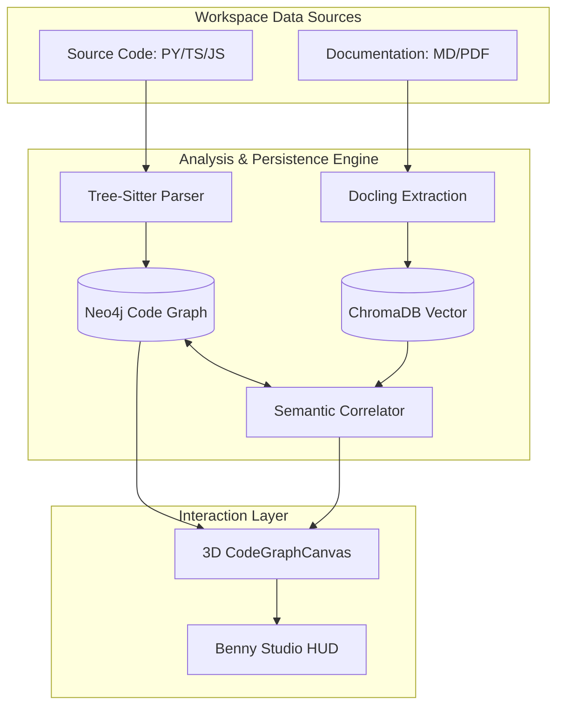

# Software Architecture Document (SAD): Benny Studio

**Project**: The Neural Nexus (Benny Studio)  
**Version**: 1.5.0 (Architect Review Edition)  
**Status**: DRAFT  
**Author**: Antigravity (Assistant Architect)

---

## 1. Executive Summary
Benny Studio is a next-generation **High-Fidelity 3D Code Intelligence System**. It aims to move beyond linear file explorers and 2D dependency maps by creating a "Neural Nexus"—a unified spatial graph where source code symbols, technical documentation, and autonomous agent history converge into a single navigable landscape.

## 2. Strategic Vision
The system is built on the premise that architectural understanding is hampered by the separation of **Semantic Knowledge** (what we write about the code) and **Source Truth** (how the code is structured). Benny Bridges this gap through real-time static analysis and semantic correlation.

## 3. High-Level Architecture (The Composite Strategy)

Benny utilizes a hybrid persistence and analysis architecture:

### 3.1 Source Extraction (Static Intelligence)
*   **Engine**: [Tree-Sitter](https://tree-sitter.github.io/tree-sitter/)
*   **Strategy**: Language-agnostic modeling using tree-sitter parsers to generate Abstract Syntax Trees (ASTs). These are filtered and projected into a directional Code Graph.
*   **Persistence**: Neo4j (labeled as `CodeEntity`, `File`, `Class`, etc.).

### 3.2 Knowledge Hub (RAG & Rationale)
*   **Engine**: [Docling](https://github.com/DS4SD/docling)
*   **Vector Stash**: ChromaDB
*   **Function**: Ingests unstructured documentation (PDF, Markdown) and correlates concepts to code symbols via embedding similarity (Cosmological Correlation).

### 3.3 Agentic Interaction (Discovery Swarm)
*   **Pattern**: Multi-agent scouting.
*   **Governance**: Unified Audit Trail (AER) and ephemeral tool manifests.
*   **Engine**: Local LLM Orchestration (Lemonade / Ollama).

## 4. Logical View (Component Mapping)

| Component | Responsibility | Primary Tech |
| :--- | :--- | :--- |
| **`CodeGraphCanvas`** | Immersive 3D Spatial Rendering | React-Three-Fiber / Three.js |
| **`CodeGraphAnalyzer`** | Polyglot Static Analysis | Tree-Sitter (Python / TS) |
| **`DiscoverySwarm`** | Autonomous Workspace Exploration | LangChain / Custom Logic |
| **`Librarian`** | Knowledge Synthesis & Wiki Gen | LLM (Metadata Extraction) |
| **`Semantic Correlation`** | Knowledge-to-Code Mapping | Vector Embeddings |

## 5. Deployment View (Local-First Infrastructure)

Benny is architected as a **Local-First AI Native IDE Component**:
*   **Containerization**: Docker-ready for Graph (Neo4j) and Vector (Chroma) backbones.
*   **Inference**: Designed to interface with local inference providers (Lemonade, Ollama, LM Studio) to ensure zero data leakage and extreme privacy.

## 6. Critical Quality Attributes
1.  **Observability**: Full lineage tracking (AER logs) for every agent action.
2.  **Scalability**: Graph snapshots allow time-series comparison of evolving architectures.
3.  **Extensibility**: BPMN 2.0 conversion layer for workflow compatibility.

---

*Ref: See [GRAPH_SCHEMA.md](./GRAPH_SCHEMA.md) for detailed node/edge modeling.*
