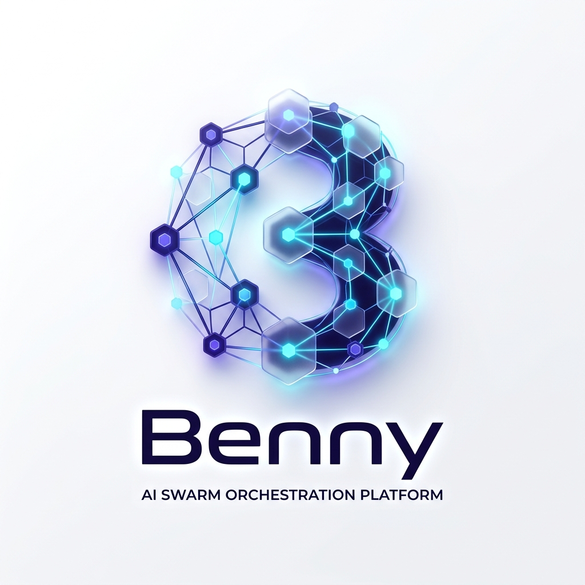

# 🐝 Benny: The Deterministic Swarm

**Master the Swarm. Reclaim Sovereignty. Build the Deterministic Core.**



Benny is a multi-model AI orchestration platform designed to transition from **Open-Loop Sovereignty** (where agents drift) to **Closed-Loop Determinism** (where manifests govern). It provides a unified control plane for **Documents**, **Code**, and **Data**.

---

## 🔄 The Closed-Loop Philosophy

Most agents today operate in an "Open Loop": they think unconstrained and act unvalidated. Benny closes the loop by externalizing reasoning into **Deterministic DAGs (Directed Acyclic Graphs)**.

*   **Constraint-First Reasoning**: Before a single token is generated, the **Manifest** defines the only valid transitions.
*   **Validation Gates**: Every action has a Validator. The agent cannot proceed until the loop is closed by a "Success" signal or Human-in-the-Loop approval.
*   **State-Graph Persistence**: Every step is checkpointed. If a model fails, Benny resumes from the exact millisecond of the failure.

---

## 💠 Three Capability Surfaces

### 1. Document Intelligence (RAG & Knowledge Graph)
Bridge architecture documents and source code. Extract `Concept` triples into Neo4j and navigate your knowledge via the **Notebook** surface. Use the **ENRICH** toggle in Studio to overlay semantic meaning onto structural graphs.

### 2. Code Engineering (Swarm & Code Graph)
Map your source code into a structural graph using Tree-Sitter. Orchestrate specialized agents to refactor, audit, or migrate codebases with 100% observability and deterministic routing.

### 3. Data Transformation (Pypes Engine)
Declarative, manifest-driven pipelines for **Bronze → Silver → Gold** transformations. Features byte-identical replay, CLP (Conceptual/Logical/Physical) lineage, and agent-driven risk narratives.

---

## 🚀 Upcoming: AOS-001 (Agentic OS)
We are evolving Benny into the first **Agentic Operating System for the SDLC**:
*   **`benny req`**: Requirements Analyst persona that converts free-text to PRDs and Gherkin BDD scenarios.
*   **TOGAF ADM Mapping**: Aligning agent waves to formal architecture phases (Vision, Business, Info Systems, Technology).
*   **VRAM-Aware Workers**: Intelligent backpressure and concurrency management for local LLM execution.
*   **Policy-as-Code**: Cryptographic intent proofs stored in an immutable, append-only Git ledger branch.

---

## 🛠 Quick Start

### 1. Initialize the Portable Home
Benny is local-first and portable. Everything lives under `$BENNY_HOME`.
```bash
pip install -e .
benny init --home D:/benny_home --profile app
setx BENNY_HOME D:\benny_home
```

### 2. Start the Stack
```bash
benny up
```

### 3. Plan & Run
```bash
# Plan a workflow
benny plan "Audit the security of the Pypes engine" --workspace c5_test --out audit.json

# Execute the signed manifest
benny run audit.json
```

---

## 📊 Observability & Governance
*   **Lineage**: OpenLineage events emitted to **Marquez** for full data provenance.
*   **Tracing**: Distributed tracing and LLM span visibility via **Phoenix**.
*   **Audit**: Every task execution writes a structured **Audit Execution Record (AER)**.
*   **Sovereignty**: `BENNY_OFFLINE=1` is a hard kill switch—enforcing local-only execution for sensitive workloads.

---

## 🏗 Architecture

| Layer | Component | Purpose |
| :--- | :--- | :--- |
| **Studio** | React / Vite | Visual Workflow Canvas, Code Graph, & Pipeline Drill-down |
| **API** | FastAPI | The Orchestration Control Plane & LangGraph Executor |
| **Kortex** | Neo4j / Chroma | The Unified Knowledge & Code Memory (Vector + Graph) |
| **Lemonade** | Local / Cloud | Multi-model Router (LiteLLM, Ollama, LM Studio, vLLM) |

---

> "If your agent has the 'will' to fail, it will. Stop building ghosts in the machine. Start building manifests."

[Brand Identity](docs/marketing/brand_identity.md) | [Operating Manual](docs/operations/BENNY_OPERATING_MANUAL.md) | [Pypes Guide](docs/operations/PYPES_TRANSFORMATION_GUIDE.md) | [AOS-001 Requirements](docs/requirements/10/requirement.md)

---
*© 2026 Benny Platform. MIT License.*
