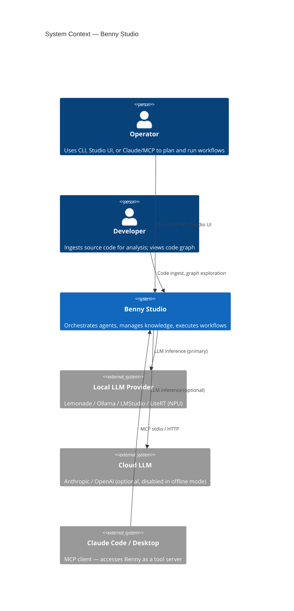
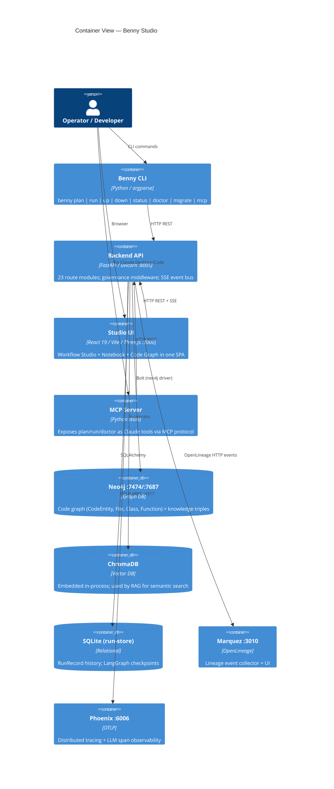

# Software Architecture Document (SAD): Benny Studio

**Project**: The Neural Nexus (Benny Studio)
**Version**: 2.0.0
**Status**: CURRENT
**Last Updated**: 2026-04-23

---

## 1. Executive Summary

Benny Studio is a **local-first, multi-model AI orchestration platform** combining three overlapping capabilities:

1. **Workflow Studio** — declarative swarm execution via signed `SwarmManifest` JSON, LangGraph-backed task DAGs, HITL approval gates.
2. **Notebook** — RAG-driven knowledge workspace: ingest PDFs/markdown, synthesise concepts, chat against a knowledge graph.
3. **Code Intelligence** — Tree-Sitter AST extraction into Neo4j, semantic correlation with the knowledge graph, 3D spatial code navigation.

The platform is **portable** (single `$BENNY_HOME` directory), **offline-capable** (`BENNY_OFFLINE=1`), and **governed** (every action emits OpenLineage events and an Audit Execution Record).

---

## 2. C4 Context Diagram



---

## 3. C4 Container Diagram



---

## 4. Docker Service Map

| Service | Image | Port(s) | Role |
|---------|-------|---------|------|
| `neo4j` | neo4j:5 | HTTP 7474, Bolt 7687 | Code graph + knowledge triple store |
| `marquez-db` | postgres:14 | 5432 (internal) | Marquez backing store |
| `marquez-api` | marquezproject/marquez:0.47.0 | 5000/5001 | OpenLineage event ingestion |
| `marquez-web` | marquezproject/marquez-web:0.47.0 | 3010 | Lineage browser UI |
| `phoenix` | arizephoenix/phoenix:latest | 4317 (OTLP gRPC), 4318 (OTLP HTTP), 6006 (UI) | Tracing + LLM span viewer |
| `n8n` | n8nio/n8n:latest | 5678 | Optional automation / webhook routing |
| Local LLMs | host process | 13305 / 11434 / 1234 / 52625 | Lemonade / Ollama / LMStudio / FastFlowLM — run on the host for NPU access |

Start all: `docker compose up -d` (from repo root). See `docker-compose.yml`.

---

## 5. API Surface

```
/api/health                    GET   liveness
/api/workflows/plan            POST  build + sign SwarmManifest
/api/workflows/execute/{id}    GET   run manifest — SSE event stream
/api/workflows/runs            GET   list run records
/api/graph/code/*              CRUD  code graph nodes + edges (LOD queries, layout)
/api/graph/code/lod            GET   level-of-detail spatial index
/api/rag/status                GET   vector store state
/api/rag/query                 POST  retrieval-only
/api/rag/chat                  POST  RAG chat (mode=semantic|graph)
/api/rag/wiki/articles         GET   workspace wiki index
/api/files/*                   POST  document upload + processing
/api/llm/*                     CRUD  model routing + provider management
/api/system/*                  GET   Neo4j, disk, workspace metrics
/api/ops/doctor                GET   JSON health check (same as benny doctor)
/api/governance/*              GET   permission + audit endpoints
```

All endpoints require `X-Benny-API-Key: benny-mesh-2026-auth` unless listed in `GOVERNANCE_WHITELIST` (`benny/api/server.py`).

---

## 6. Dual-Graph Architecture

The platform intentionally maintains **two separate graphs** serving different purposes. They are stored in the same Neo4j instance under different node labels, but visualised in different UI surfaces.

### 6.1 Notebook Knowledge Graph (`KnowledgeGraphCanvas`)

- **Location**: `frontend/src/components/Notebook/KnowledgeGraphCanvas.tsx`
- **Backend**: `benny/api/rag_routes.py`, `benny/core/adaptive_rag.py`
- **Node types**: `Concept`, `Document`, `Documentation`
- **Edge types**: `REL {predicate}`, `CORRELATES_WITH`
- **Purpose**: Maps semantic relationships extracted from ingested PDFs and markdown. Shows *what concepts exist* and *how they relate* based on the content of your knowledge base.
- **Populated by**: Document ingestion (`/api/files/upload`), triple extraction, synthesis engine.

### 6.2 Studio Code Graph (`CodeGraphCanvas`)

- **Location**: `frontend/src/components/Studio/CodeGraphCanvas.tsx`
- **Backend**: `benny/api/graph_routes.py`, `benny/graph/code_analyzer.py`
- **Node types**: `CodeEntity`, `File`, `Class`, `Function`, `Folder`, `Interface`
- **Edge types**: `DEFINES`, `INHERITS`, `DEPENDS_ON`, `CONTAINS`
- **Purpose**: Structural map of source code extracted by Tree-Sitter AST analysis. Shows *how code is organized* — file dependencies, class hierarchies, function definitions.
- **Populated by**: Code analysis (`/api/graph/code/analyze`), Tree-Sitter parsers (Python, TypeScript, JavaScript).

### 6.3 Code-Knowledge Enrichment Toggle

**Concept**: A toggle in Benny Studio that overlays `CORRELATES_WITH` and `REPRESENTS` edges from the knowledge graph onto the code graph, linking `CodeEntity` nodes to `Concept` nodes.

**Use case (c5_test)**: UML documents and architecture PDFs have been ingested in c5_test. The enrichment pipeline allows an operator to see *which concepts from architecture documents map onto which source symbols* — closing the loop between design intent and implementation.

**Pipeline** (`benny enrich`): a fixed 7-task DAG across 5 waves, driven by the declarative v2.0 manifest at `manifests/templates/knowledge_enrichment_pipeline.json`.

```
Wave 0 (parallel):   pdf_extract (inspect_and_classify), code_scan (fire_and_poll)
Wave 1:              rag_ingest (blocking_with_task_fallback, 1800s)
Wave 2:              deep_synthesis (blocking_with_task_list_fallback, 1800s)
Wave 3:              semantic_correlate (blocking, 900s) — emits CORRELATES_WITH
Wave 4 (parallel):   validate_enrichment, generate_report
```

Key architectural properties:

1. **Fully declarative** — every endpoint, HTTP method, body shape, timeout, polling rule, and fallback policy lives in the manifest. The CLI dispatches purely from the `execution.kind` tag on each task; nothing is hardcoded in Python about which endpoint a task calls.
2. **Variable substitution** — `${workspace}`, `${src_path}`, `${model}`, `${correlation_threshold}`, `${api_base}`, `${benny_home}`, `${run_id}`, `${task_run_id}`. Resolved from CLI flags → env vars → `manifest.variables` defaults.
3. **Resumable** — `--resume <prior_run_id>` reads `workspace/<ws>/runs/enrich-<id>/task_*.json` and skips any task whose status is in `execution.resume.skip_if_status` (default: `done`, `completed`, `completed_after_timeout`). Cross-task artefacts (e.g. `pdf_extract.emits.pdf_files`) are rehydrated from the prior run's recorded result.
4. **Timeout-resilient** — blocking tasks (`rag_ingest`, `deep_synthesis`) carry a `fallback_on_timeout` block that queries `task_manager` status when the POST dies, so client-side timeouts don't mask server-side success.
5. **Windows FD-safe** — `benny/api/server.py` pins `WindowsProactorEventLoopPolicy` at module import to avoid `ValueError: too many file descriptors in select()` under heavy ingest load (default `SelectorEventLoop` caps around 512 FDs).

**Prerequisites**:
1. c5_test knowledge graph passes coherence check (`/api/rag/status?workspace=c5_test`).
2. Semantic correlator has run (`POST /api/rag/correlate` — invoked as `semantic_correlate` wave).
3. Neo4j has `CORRELATES_WITH` edges linking `Concept` → `CodeEntity` for the target workspace.

**Full reference**: [docs/operations/KNOWLEDGE_ENRICHMENT_WORKFLOW.md](../docs/operations/KNOWLEDGE_ENRICHMENT_WORKFLOW.md).

**Studio implementation path**:
- Add `enrichmentMode: boolean` to `uiSlice.ts` in the Zustand store.
- Extend `graph_routes.py` `/api/graph/code/lod` to accept `?enrich=true` — join `CodeEntity` nodes with their `CORRELATES_WITH` `Concept` neighbours in the Cypher query.
- Render enrichment edges in `CodeGraphCanvas.tsx` as a distinct particle/edge style (e.g. dashed gold) separate from structural edges.

---

## 7. Plan → Execute Lifecycle

```
Operator input (natural language requirement)
    │
    ▼
benny plan (or POST /api/workflows/plan)
    │  benny/graph/manifest_runner.py::plan_from_requirement()
    │  → Planner LLM call → SwarmManifest (tasks, waves, input/output specs)
    │  → manifest_hash.py::sign_manifest() — HMAC-SHA256 signature
    │
    ▼
SwarmManifest JSON (signed, stored in $BENNY_HOME/workflows/)
    │
    ▼
benny run (or GET /api/workflows/execute/{id}) — SSE stream
    │  benny/graph/swarm.py — LangGraph state machine
    │  → wave_scheduler.py — parallel wave fan-out
    │     → local_executor.py — task execution (LC-1..4)
    │     → call_model() for each LLM step
    │
    ├── SSE events: plan_updated → wave_started → task_started → task_completed → run_finished
    ├── AER (Audit Execution Record) per task → benny/governance/audit.py
    ├── OpenLineage events → Marquez (if MARQUEZ_URL set)
    └── OTLP spans → Phoenix (if PHOENIX_ENDPOINT set)
    │
    ▼
RunRecord persisted to SQLite ($BENNY_HOME/runs/)
```

---

## 8. Workspace Structure

Each workspace lives at `$BENNY_HOME/workspaces/<name>/` and is self-contained:

```
workspaces/<name>/
├── manifest.yaml          # workspace config (default_model, tools, wiki config)
├── AGENTS.md              # agent coding standards + governance rules
├── SOUL.md                # agent persona definition
├── USER.md                # user preferences
├── data_in/               # source documents for ingestion
├── data_out/              # generated artefacts
├── chromadb/              # vector store (per-workspace, isolated)
├── manifests/             # signed SwarmManifest JSONs
├── runs/                  # run records
├── reports/               # generated analysis reports
└── src/                   # source code to analyse (code graph workspaces)
```

### 8.1 Active Test Workspaces

| Workspace | Purpose | Key Content |
|-----------|---------|-------------|
| `c4_test` | Workflow + RAG test ground | H.G. Wells texts ingested as markdown (`data_in/`); validates end-to-end ingestion → retrieval → chat |
| `c5_test` | Code analysis + architecture mapping | UML diagrams and architecture PDFs ingested to markdown; `src/` contains `dangpy` source; used to map design documents onto code structure |

**c5_test status**: UML/architecture documents are ingested in the knowledge graph, the Tree-Sitter code analyser populates the code graph from `src/dangpy` (~1800 nodes), and the declarative enrichment pipeline (`benny enrich --manifest manifests/templates/knowledge_enrichment_pipeline.json`) generates `CORRELATES_WITH` edges between architecture concepts and code symbols. The Studio ENRICH toggle consumes those edges as an overlay on the code graph.

---

## 9. Swarm-Based Code Walkthrough → SAD Generation

A **swarm of specialised agents** can be orchestrated via a `SwarmManifest` to produce a Software Architecture Document automatically. The agents walk the codebase independently, then synthesise findings into a structured document.

### Proposed Manifest Structure

```
Wave 1 (parallel discovery):
  Task A: CodeStructureScout     — runs code analyser, extracts entity stats
  Task B: APIMapper              — reads all route files, extracts endpoints
  Task C: DataFlowAnalyst        — traces call chains through graph_db.py, models.py
  Task D: InfraMapper            — reads docker-compose.yml, services.py, config.toml
  Task E: GovernanceAuditor      — reads governance/, audit.py, lineage.py

Wave 2 (synthesis, depends on Wave 1 outputs):
  Task F: SADWriter              — ingests all Wave 1 outputs → generates structured SAD.md
  Task G: DiagramGenerator       — emits Mermaid C4 + sequence diagrams from structured data

Wave 3 (validation):
  Task H: SADReviewer            — cross-checks SAD claims against live Neo4j entity stats
```

### How to Trigger

```bash
# Plan the SAD generation swarm
benny plan "Generate a complete Software Architecture Document for the benny workspace" \
    --workspace c5_test \
    --output reports/SAD_generated.md \
    --model lemonade/Llama-3.1-70B-Instruct \
    --out manifests/sad_gen.manifest.json

# Review the manifest, then execute
benny run manifests/sad_gen.manifest.json --json
```

The generated SAD will be written to `c5_test/data_out/reports/SAD_generated.md` and can be compared against this hand-authored document for coverage gaps.

---

## 10. Quality Attributes

| Attribute | Mechanism |
|-----------|-----------|
| **Observability** | SSE event stream, AER audit trail, OpenLineage → Marquez, OTLP → Phoenix |
| **Reproducibility** | Manifests are signed (HMAC-SHA256); any run can be replayed with `benny run <manifest>` |
| **Portability** | Single `$BENNY_HOME` directory; `benny migrate` rewrites paths and re-signs manifests |
| **Offline capability** | `BENNY_OFFLINE=1` blocks all cloud LLM calls; local providers (Lemonade, Ollama) keep system running |
| **Governance** | `X-Benny-API-Key` on all API calls; `GovHeaderMiddleware` enforces whitelist; RBAC in `benny/gateway/rbac.py` |
| **Testability** | 6σ release gates: G-COV (≥85%), G-SR1 (≤408 path violations), G-LAT (<300ms), G-ERR (0 flakes), G-SIG, G-OFF |

---

## 11. Key Module Map

| Concern | Module |
|---------|--------|
| Manifest types + schema | `benny/core/manifest.py` |
| Manifest signing | `benny/core/manifest_hash.py` |
| LLM router + offline | `benny/core/models.py` |
| Swarm execution (LangGraph) | `benny/graph/swarm.py` |
| Plan → manifest | `benny/graph/manifest_runner.py` |
| Code analyser (Tree-Sitter) | `benny/graph/code_analyzer.py` |
| Neo4j driver | `benny/core/graph_db.py` |
| RAG + hybrid retrieval | `benny/core/adaptive_rag.py` |
| Knowledge synthesis | `benny/synthesis/engine.py` |
| AER audit trail | `benny/governance/audit.py` |
| OpenLineage emission | `benny/governance/lineage.py` |
| OTLP tracing | `benny/governance/tracing.py` |
| HTTP API root | `benny/api/server.py` |
| SSE event bus | `benny/core/event_bus.py` |
| Portable home | `benny/portable/home.py` |
| Service manager | `benny/portable/runner.py` |
| MCP server | `benny/mcp/server.py` |

---

*Ref: [GRAPH_SCHEMA.md](./GRAPH_SCHEMA.md) for Neo4j node/edge modeling details.*
*Ref: [docs/operations/BENNY_OPERATING_MANUAL.md](../docs/operations/BENNY_OPERATING_MANUAL.md) for run book.*
*Ref: [docs/operations/LOG_AND_LINEAGE_GUIDE.md](../docs/operations/LOG_AND_LINEAGE_GUIDE.md) for log/lineage observability.*
