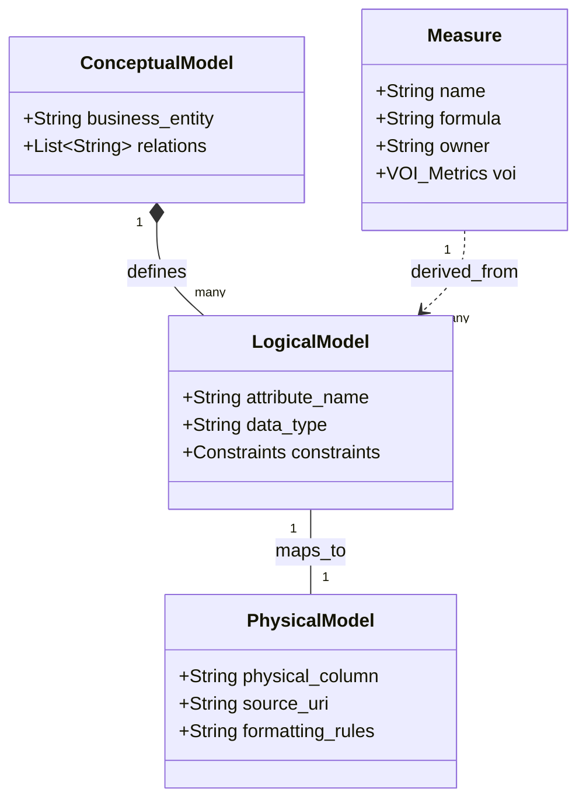
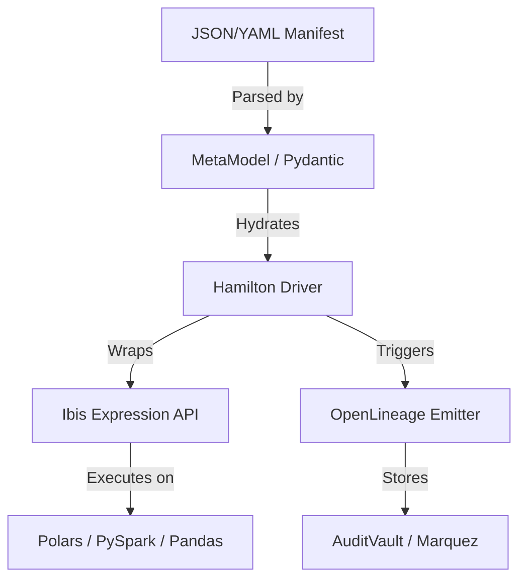
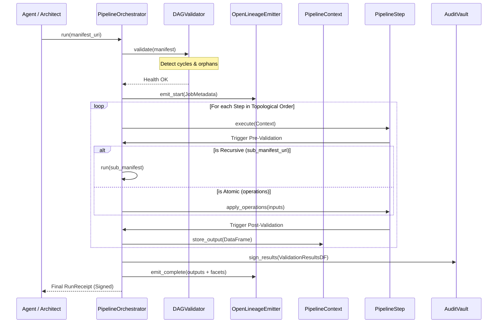

This plan evolves the Pypes engine from a linear processor to a **Next-Generation, Regulatory-Compliant DAG Engine**. It integrates the foundational vision from **Requirement 1** with the high-fidelity financial engineering standards of **Requirement 2**.

## User Review Required

> [!IMPORTANT]
> **Next-Generation Financial Architecture**
> This project is evolving into a **Polymorphic Execution Engine** for highly regulated markets (BCBS 239). It abstracts computational engines (Pandas, Polars, PySpark) using **Ibis** and orchestrates them via **Hamilton** stateless DAGs.
>
> **Core Pillars Added:**
> 1. **CLP Semantic Meta-Model**: Formal UML-backed mapping of Business Concepts to Physical Data.
> 2. **Hamilton + Ibis Integration**: Decoupling transformation logic from infrastructure.
> 3. **LakeFS Sandboxing**: Git-like data versioning for zero-copy parallel testing.
> 4. **Agentic AI Orchestration**: Use of LLM-generated manifests (not code) for self-healing pipelines.
>
> **Breaking Change**
> The `ExecutionContract` will transition from a top-level `operations` list to a `steps` list. Legacy linear contracts can be auto-migrated via a helper function.

## Proposed Changes

### Core Models & UML Design
- **[MODIFY] [models.py](file:///c:/Users/nsdha/OneDrive/code/pypes/pypes/contracts/models.py)**: 
    - **CLP UML Implementation**: Formally link `Conceptual -> Logical -> Physical` (see UML below).
    - **Measure Definitions & VoI**: Add `ValueOfInformation` tracking metrics.
    - **Step-Based DAG (Hamilton)**: Update `PipelineStep` to support Hamilton-style function extraction.

#### UML: Semantic Meta-Model Relations


#### UML: Core Class Dependencies


- **[NEW] [context.py](file:///c:/Users/nsdha/OneDrive/code/pypes/pypes/core/context.py)**: Define `PipelineContext` to manage local dataframe states.

### Core Logic & Orchestration
- **[MODIFY] [pipeline.py](file:///c:/Users/nsdha/OneDrive/code/pypes/pypes/core/pipeline.py)**: 
    - Implement **Recursive Execution**: If a `PipelineStep` contains a `sub_manifest_uri`, the orchestrator will resolve the path and trigger a nested `run()` call with the current `PipelineContext`.
    - Implement the "Topological Multi-Stage" execution loop.
    - Integrate pre/post step-level validation hooks.
    - Integrate OpenLineage lifecycle calls.
- **[MODIFY] [polars_impl.py](file:///c:/Users/nsdha/OneDrive/code/pypes/pypes/engines/polars_impl.py)**:
    - Add `union` and `join` as standard operations to support merging.

---

## 2. Process Flow (Sequence Diagram)

This diagram illustrates the "Governance-First" execution of a recursive, branching pipeline.



---

## 3. Manifest Examples (Production Grade)

### Master Manifest: `risk_pipeline.json`
Focuses on the high-level architecture and branching.

```json
{
  "metadata": {
    "contract_name": "Market Risk Daily Agg",
    "version": "2.1.0",
    "governance": { "compliance_tags": ["BCBS-239"], "manifest_hash": "sha256:8f3..." }
  },
  "steps": [
    {
      "name": "load_fo_trades",
      "outputs": ["raw_trades"],
      "operations": [{"operation": "load", "params": {"uri": "s3://trades/raw.parquet"}}]
    },
    {
      "name": "cleanse_branch",
      "inputs": ["raw_trades"],
      "outputs": ["cleansed_trades"],
      "sub_manifest_uri": "library/cleansing_v2.json",
      "validations": { "post": ["null_check"] }
    },
    {
      "name": "calc_exposure",
      "inputs": ["cleansed_trades"],
      "outputs": ["gold_exposure"],
      "operations": [
        {"operation": "calc", "params": {"expr": "notional * fx_rate", "target": "usd_exposure"}}
      ],
      "validations": { "post": ["exposure_limit"] }
    }
  ],
  "rules": {
    "exposure_limit": { "type": "max", "limit": 100000000 }
  }
}
```

### Sub-Manifest: `library/cleansing_v2.json`
Contains the encapsulated "black-box" logic.

```json
{
  "contract_name": "Standard Trade Cleansing",
  "steps": [
    {
      "name": "type_normalization",
      "inputs": ["raw"],
      "outputs": ["normalized"],
      "operations": [
        {"operation": "standardize", "params": {"col": "account_no"}},
        {"operation": "cast", "params": {"col": "trade_date", "to": "date"}}
      ]
    }
  ]
}
```

### Example: Golden Measure & CLP Mapping
This section defines how business-level metrics are mapped to physical data assets for the Golden Catalogue.

```json
{
  "semantic_layer": {
    "measures": [
      {
        "name": "Total Daily Exposure",
        "formula": "sum(Trade.notional)",
        "owner": "Head of Risk",
        "logical_dependency": ["Trade.notional"],
        "status": "GOLDEN"
      }
    ],
    "conceptual": { "entities": ["Trade", "Counterparty"] },
    "logical": {
      "entities": [
        { "name": "Trade", "attributes": ["id", "notional", "ccy"] }
      ]
    },
    "physical_mapping": {
       "Trade.notional": { "source": "S3_FO_TRADES", "column": "TRD_AMT" }
    }
  }
}
```

---

## Design Refinements from Peer Review

1. **Hamilton Statelessness**: Every operation is converted into a Hamilton node. Function names declare outputs, and argument type-hints declare inputs, creating a self-documenting DAG.
2. **Polymorphic Execution (Ibis)**: Transformations are written once in Ibis and compiled to the backend (Polars for local, PySpark for cluster) as defined in the `contract.metadata.engine_preference`.
3. **Data Quality & VoI**: Integrated movement analysis (Z-Score/IQR) and Value of Information tracking to justify compute/storage costs.
4. **LakeFS Zero-Copy Branching**: Integration for sandboxed runs. A `sandbox_id` in the manifest triggers a LakeFS branch creation, ensuring production data remains untouched.
5. **Agentic Rationale**: AI-generated `Rationale Articles` explain the prompt-to-manifest logic, providing a "Cognitive Audit" of the pipeline's intent.

## Verification Plan

### Automated Tests
- Integration test for a "Branch and Merge" scenario (splitting a dataset, applying different math, and unioning back).
- Unit test for `PipelineContext` to ensure state isolation between parallel steps.
