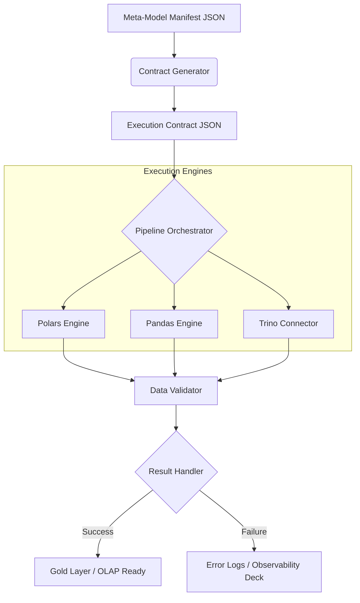
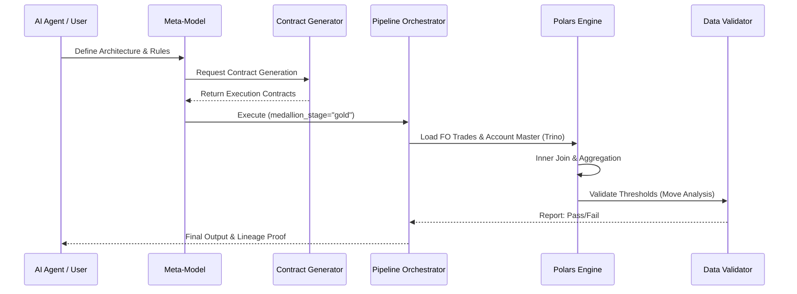

# Pypes Architectural Design

This document provides the technical blueprints for Pypes, ensuring it is built for scalability, transparency, and community standards.

## 1. System Architecture (UML)

### Core Component Diagram


### Sequence Diagram: Investment Bank Trade Aggregation


---

## 2. Directory Structure (Community-Ready)

```text
pypes-engine/
├── .github/                # CI/CD Workflows
├── docs/                   # Documentation (MkDocs/Sphinx)
├── examples/               # Refinement Sandboxes
│   └── investment_bank/    # Market Risk Use Case
├── pypes/                  # Main Package
│   ├── __init__.py
│   ├── meta/               # Design-First Layer
│   │   ├── models.py       # Pydantic: ArchitectureMeta, EntityMeta
│   │   └── generator.py    # Logic: Meta -> Contract
│   ├── contracts/          # Execution Layer
│   │   └── models.py       # Pydantic: TransfromationContract
│   ├── core/               # Orchestration Layer
│   │   ├── engine.py       # Abstract Base Classes (ExecutionEngine)
│   │   └── pipeline.py     # Stateless Pipeline Service
│   ├── engines/            # Concrete Backend Implementations
│   │   ├── polars_impl.py  # High-performance Polars logic
│   │   ├── pandas_impl.py  # Standard Pandas logic
│   │   └── trino_impl.py   # Virtualization / Federated logic
│   ├── validators/         # Data Quality & Observability
│   │   ├── correctness.py  # Schema & Type checks
│   │   └── statistical.py  # Move Analysis & Thresholds
│   └── utils/              # Logging, Telemetry, and Exceptions
├── tests/                  # TDD/BDD Test Suite
│   ├── unit/
│   ├── integration/
│   └── features/           # Gherkin Scenario Scripts (.feature)
├── pyproject.toml          # Modern dependency management
└── README.md               # User & Agent onboarding
```

---

## 3. Design Decisions & Abstractions

### Stateless Execution
Every "Operation" in the JSON contract is mapped to a pure function within an `ExecutionEngine`. The `PipelineOrchestrator` maintains no state other than the reference to the current DataFrame. This allows AI agents to "replay" or "sandbox" specific segments of a pipeline safely.

### Pure Abstraction (Engine Protocol)
```python
class ExecutionEngine(Protocol):
    def load(self, source: SourceModel) -> DataFrame: ...
    def join(self, left: DataFrame, right: DataFrame, on: str) -> DataFrame: ...
    def aggregate(self, df: DataFrame, config: AggConfig) -> DataFrame: ...
    def validate(self, df: DataFrame, rules: List[ValidationRule]) -> ValidationResult: ...
```

---

## 4. Community Readiness (Checklist)
To be ready for upload by tomorrow, the following must be in place:
1.  **Strict Typing**: 100% `mypy` compliance using Pydantic V2.
2.  **Documentation**: `README.md` must include an "Agent-Handoff" section explaining how AI tools should interact with the Meta-Model.
3.  **License**: Standard MIT or Apache 2.0 license.
4.  **Zero-Config Install**: `pip install pypes-engine` should work out-of-the-box with sane defaults.
