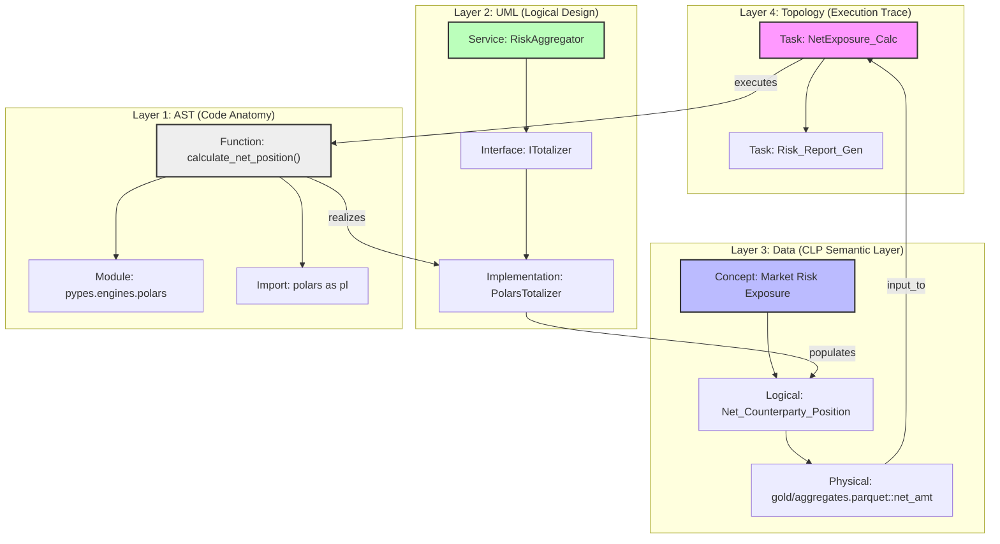

# Pypes: Production-Grade Implementation Plan (Benny-Informed)

This plan synthesizes the foundational requirements of Pypes with the critical technical and operational insights gained from the stabilization of the "Benny Studio" platform. It evolves Pypes from a linear transformation engine into a **Next-Generation, Regulatory-Compliant DAG Engine** that is optimized for both human architects and AI agents.

## User Review Required

> [!IMPORTANT]
> **Architectural Pivot: The CLI-First / UI-Observer Model**
> Following the Benny Studio post-mortem, we are moving to a model where the **CLI/Service Layer** is the single point of truth. The UI (if any) is a visual observer of the "Execution Contract" (The Manifest).
>
> **Core Pillars:**
> 1. **CLP Semantic Meta-Model**: Conceptual -> Logical -> Physical mapping for regulatory traceability (BCBS-239).
> 2. **Hamilton + Ibis Orchestration**: Decoupling transformation logic (Ibis) from the execution graph (Hamilton).
> 3. **Progressive Discovery (The Drill-Down Mantra)**: High-level aggregated views with deep-link capabilities into attribute-level details across governance, observability, and execution.
> 4. **Unified Activity Control Plane**: A single "glass-pane" that bridges traditional ETL (OpenLineage/Marquez) with Agentic activities (RAG, Chat, Synthesis, Manifest Generation).
> 5. **Digital Workspace Harness**: A "context-locked" environment for agents that enforces boundaries, enables human/agent review loops, and facilitates swarm task decomposition.
> 6. **Hierarchical Workspace Architecture**: Isolated execution at the "Leaf" level (Books, Code, Trades) with a global governance "Index" at the project root.
> 7. **Unified File Access API**: A single, file-based "Source of Truth" API shared by Agents (MCP/CLI), Humans (UI), and Workflows (Swarm).
> 8. **Resilient Agentic Toolkit**: Built-in mechanisms to handle LLM instability, context drift, and "broken data" patching loops.
> 9. **The Graphify Multi-Layer Graph**: AST + UML + Data (CLP) + Topology synthesis for end-to-end system visibility.
> 10. **The Agentic Workspace Mantra**: Isolated "Healing branches" where agents can experiment, verify, and propose changes without polluting the main codebase.
> 11. **The Kortex Session Store**: A cryptographically hashed session-based storage (`/kortex/{session_hash}/`) that captures the "Raw Soul" of every interaction: chats, audits, manifest variations, and execution traces.

## Open Questions
- **LakeFS Integration**: Do we want to require LakeFS for local development, or make it an optional "Production-Only" adapter?
- **Governance Storage**: Should the `AuditVault` (signed validation results) be a local SQLite DB (DuckDB) or a centralized Postgres instance by default?

---

## 1. Core Architecture & Models

### [MODIFY] [contracts/models.py](file:///c:/Users/nsdha/OneDrive/code/pypes/pypes/contracts/models.py)
Update to support the transition from linear lists to DAG-based steps and the CLP Semantic Layer.

- **[NEW] `CLPMetaModel`**: Implements the hierarchy of Business Concepts -> Logical Attributes -> Physical Assets.
- **[NEW] `PipelineStep`**: Replaces the linear `OperationModel`. Each step defines its own `inputs`, `outputs`, and `operations`.
- **[NEW] `WorkspaceManifest`**: Defines the boundaries, engines, and compliance rules for an isolated workspace (e.g., "Trade Reports 2024").
- **[NEW] `GlobalProjectIndex`**: A top-level registry that tracks all active workspaces, their cross-workspace dependencies, and aggregated health scores.
- **[NEW] `ManifestMetadata`**: Includes governance tags, compliance signatures (e.g., BCBS-239), and versioning.

### [NEW] [core/config.py](file:///c:/Users/nsdha/OneDrive/code/pypes/pypes/core/config.py)
**Solution for Benny Pain Point #2 & #5 (Infrastructure & Ports)**
- Implement a `ServiceRegistry` that handles dynamic port discovery and timeout management.
- Centralize all LLM provider configs, avoiding hardcoded URLs in the engine logic.

### [NEW] [core/files.py](file:///c:/Users/nsdha/OneDrive/code/pypes/pypes/core/files.py)
**Solution for Benny Pain Point #3 & #11 (Unified Access)**
- **The "Single File API"**: Implement a centralized `FileService` that acts as the gateway for all file I/O.
- **Shared Access Patterns**:
    - **MCP/CLI**: Agents use the service to read/write manifests and data.
    - **UI**: The React frontend calls the same FastAPI endpoint wrapping this service.
    - **Workflows**: The Hamilton/Swarm orchestrator uses this for all `load` and `store` operations.
- **Metadata Enrichment**: Every "Get File" call automatically attaches provenance and compliance tags from the `CLPMetaModel`.

### [NEW] Standardized Workspace Layout
**Solution for Benny Pain Point #1 & #12 (Folder Fragmentation)**
Implement a rigid, predictable folder structure for all Pypes projects:
```text
/project_root
├── global_index.json       # Top-level registry of all workspaces
├── kortex/                 # The "Cognitive Memory" of the project
│   ├── {session_hash_A}/   # Immutable record of Session A
│   │   ├── chat_logs.jsonl
│   │   ├── audit_reports.json
│   │   ├── manifest_snapshots/
│   │   └── execution_telemetry.json
│   └── {session_hash_B}/
├── workspaces/             # Isolated context (e.g., Trade Reports)
```

---

## 2. Execution & Orchestration

### [MODIFY] [core/pipeline.py](file:///c:/Users/nsdha/OneDrive/code/pypes/pypes/core/pipeline.py)
Implement the **Hamilton-backed DAG Orchestrator**.

- **Recursive Execution & Drill-Down**: Support for `sub_manifest_uri` to enable modular, reusable pipeline blocks. The orchestrator must allow "walking" into sub-DAGs for detailed inspection without losing the top-level context.
- **Topological Sorting**: Use Hamilton to resolve the execution order of steps based on their declared inputs/outputs.
- **Pre/Post Step Validation**: Hooks to trigger "Correctness" and "Completeness" checks at every node in the DAG.

### [MODIFY] [engines/polars_impl.py](file:///c:/Users/nsdha/OneDrive/code/pypes/pypes/engines/polars_impl.py)
- Integrate **Ibis** as the primary expression language. This allows the same "Operation" to be compiled for Polars (local) or PySpark (cluster) without code changes.
- Implement specialized join/union operations for merging branches in the DAG.

---

## 3. Observability & Governance

### [NEW] [utils/governance.py](file:///c:/Users/nsdha/OneDrive/code/pypes/pypes/utils/governance.py)
**Solution for Benny Pain Point #4 & #11 (Unified Observability)**
- **OpenLineage + Agentic Events**: Extend the emitter to capture non-ETL events:
    - **RAG Trace**: Log retrieval hits, source provenance, and context generation.
    - **Chat Interaction**: Link user queries to the specific semantic graph nodes accessed.
    - **Manifest Lifecycle**: Log when an agent creates or modifies a workflow manifest.
- **Marquez Integration (Unified Namespace)**: Ensure all activities (Ingestion, Indexing, Synthesis, RAG) share a consistent namespace in Marquez for end-to-end lineage.
- **Signed Audit Vault**: Write validation results to a local DuckDB instance with cryptographic hashes.
- **Progressive Traceability**: Implement a "Drill-Back" API that allows a user to go from a Gold-layer aggregate (e.g., Total Exposure) down to the specific Bronze-layer source records and their transformation history.

---

## 4. Agentic Optimization (The "Agent Toolbox")

**Solution for Benny Pain Point #9 & #12 (Agentic Friction & Token Waste)**

- **Architecture Map (Auto-Handoff)**: A utility that generates a high-level "System Map" for AI agents at the start of a session, reducing redundant `ls -R` and `grep` calls.
- **Swarm Orchestration (Lead -> Deep Agents)**: Implement a decomposition pattern where a "Lead Agent" can generate sub-manifests for "Deep Agents." The harness ensures each sub-agent is locked to a narrow, immutable context.
- **Agentic "Mechanical Review"**: A specialized DAG step type that requires a `Signed Rationale` (JSON) from an agent. This facilitates automation that requires a "conscious" review before data is promoted to the Gold layer.
- **Cognitive Audit Logs**: When an LLM generates a manifest, the engine captures the "Rationale Article" (the intent) alongside the JSON to prevent "Silent Completion Hallucinations."
- **LLM Middleware (Resilience)**:
    - **Reasoning Strip**: Automatically strip `<think>` blocks from model outputs before JSON parsing.
    - **Schema Enforcement**: Strict Pydantic validation for any agent-generated sub-manifests before execution.

---

## 5. The Graphify Protocol (Multi-Layer Synthesis)

**Solution for the "How do I link code to data?" Challenge**

This protocol implements a multi-layered knowledge graph that bridges literal code structures with abstract business logic and physical execution.

### [NEW] [graph/bridge.py](file:///c:/Users/nsdha/OneDrive/code/pypes/pypes/graph/bridge.py)
- **Layer 1: AST (Code)**: Parses Python source via `tree-sitter` to extract syntax-level dependencies (Modules, Classes, Functions).
- **Layer 2: UML (Abstraction)**: Uses type hints and decorators to infer logical design (Interfaces, Services, Logical Models).
- **Layer 3: Data (CLP)**: Maps logical attributes to the `CLPMetaModel` (Conceptual -> Logical -> Physical).
- **Layer 4: Topology (Deployment)**: Integrates Hamilton DAG execution traces to show where code/data interact at runtime.

### [NEW] [core/harness.py](file:///c:/Users/nsdha/OneDrive/code/pypes/pypes/core/harness.py)
**The "Agent Workspace Mantra" Implementation**
- **Isolation**: Every agent healing session occurs in a dedicated "Harness Workspace" (Git branch + isolated directory).
- **Self-Healing Loop**:
    1. **Trace**: Trace a Topology failure back to the Code (AST) and Data (CLP) origins.
    2. **Patch**: Agent applies modifications in the isolated sandbox.
    3. **Verify**: Run the Hamilton DAG in the sandbox to confirm "Data Health Score" improvement.
    4. **Propose**: Generate a comparison view (Current vs. Proposed) in the 3D Graph for human review.
- **User Pull-In**: A CLI command `pypes pull <agent_session_hash>` allows a human to review and merge the agent's verified patch.

---

## 6. Implementation Blueprints (Concrete Examples)

### 6.1 The Graphify Multi-Layer Graph (Cross-Section)

The "Graphify" protocol bridges four distinct layers of the system into a unified 3D visualization, enabling "Drill-Down" from Business Concepts to specific lines of code.



### 6.2 The Execution Contract (Workspace Manifest)

A Pypes manifest is a declarative "Contract" that defines how data moves through the CLP layers. It is the single source of truth for both the Human Architect and the AI Agent.

```json
{
  "manifest_id": "market_risk_agg_2024",
  "version": "1.2.0",
  "workspace": "global_markets_prod",
  "governance": {
    "compliance_tag": "BCBS-239",
    "owner": "Risk_Quant_Team",
    "criticality": "High"
  },
  "clp_context": {
    "conceptual_domain": "Credit Risk",
    "logical_entity": "CounterpartyExposure",
    "physical_target": "s3://risk-lake/gold/counterparty_exposure.parquet"
  },
  "dag": {
    "steps": [
      {
        "id": "ingest_raw_trades",
        "engine": "polars",
        "operation": "read_parquet",
        "args": { "path": "bronze/trades/*.parquet" },
        "observability": { "lineage_emit": true }
      },
      {
        "id": "apply_clp_schema",
        "dependencies": ["ingest_raw_trades"],
        "engine": "ibis",
        "operation": "cast_and_validate",
        "args": { 
          "schema_ref": "contracts/schemas/exposure_v1.json",
          "on_failure": "quarantine" 
        }
      },
      {
        "id": "agentic_healing_check",
        "dependencies": ["apply_clp_schema"],
        "engine": "swarm",
        "operation": "mechanical_review",
        "args": {
          "prompt": "Verify trade IDs follow the ISO-20022 format. If not, propose a regex patch.",
          "required_rationale": true
        }
      }
    ]
  }
}
```

### 6.3 The Agentic Workflow (The Swarm Loop)

This example illustrates how a "Lead Agent" decomposes a complex governance task into a "Sandboxed Verification" loop.

1.  **Trigger**: The `agentic_healing_check` step detects malformed trade IDs in the `apply_clp_schema` output.
2.  **Lead Agent (Planning)**:
    - Scans the `Graphify` graph to identify the `AST` node responsible for ID parsing.
    - Creates a `kortex` session: `/kortex/healing_session_99/`.
    - Generates a **Sub-Manifest** for a "Deep Agent" specialized in Regex/Polars logic.
3.  **Deep Agent (Execution in Harness)**:
    - Checks out a new Git branch `fix/trade-id-parsing`.
    - Modifies `pypes/engines/cleansing.py` (The AST node).
    - Executes the Hamilton DAG locally within the `kortex` sandbox.
4.  **Verification (AuditVault)**:
    - The engine compares the "Data Health Score" before and after the patch.
    - Audit results are cryptographically signed and stored in the local `AuditVault` (DuckDB).
5.  **Human Review**:
    - The human architect opens the 3D UI, seeing the "Proposed Patch" highlighted in the graph (Layer 1 changed, Layer 3 Health increased).
    - Human runs `pypes pull healing_session_99` to merge the verified fix.

---

## 7. Verification Plan

### Automated Tests (TDD First)
- **`tests/test_clp_validation.py`**: Verify that physical columns map correctly to business concepts.
- **`tests/test_dag_branching.py`**: Test a "Split-Apply-Merge" scenario where a single source is processed in two branches and joined back.
- **`tests/test_resilience.py`**: Mock malformed JSON and LLM timeouts to ensure the engine fails gracefully with clear diagnostics.

### Manual Verification
- **Scenario Run**: Execute the "Market Risk Aggregation" case study from the requirements, verifying that `transformed_trades.parquet` matches the expected business rules and passes Move Analysis.
- **Agent Handoff**: Ask an AI agent to "Modify the cleansing step to remove special characters from trade IDs" and verify it generates a valid, executable sub-manifest.
- **Self-Healing Run**: Simulate a "Data Break" and trigger the `pypes graphify heal` command. Verify that the agent creates a sandbox, patches the code, and generates a pull request.

